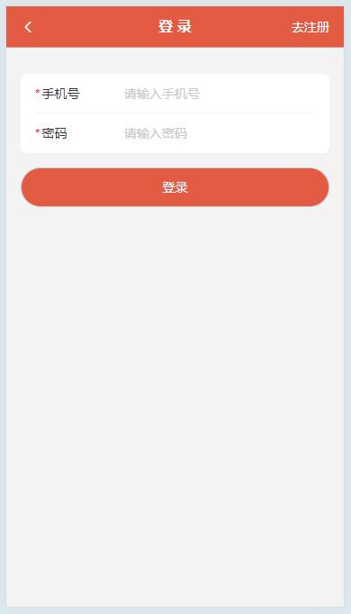
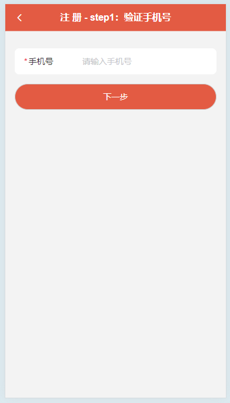
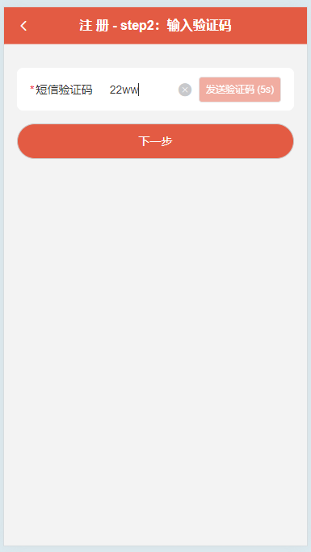
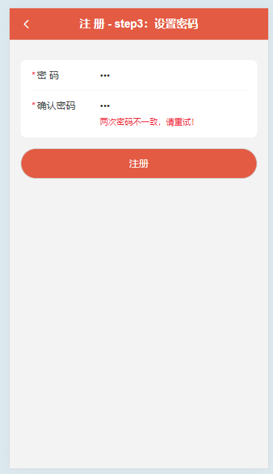
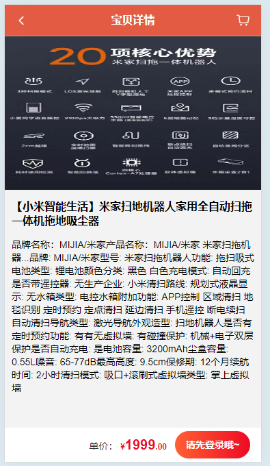
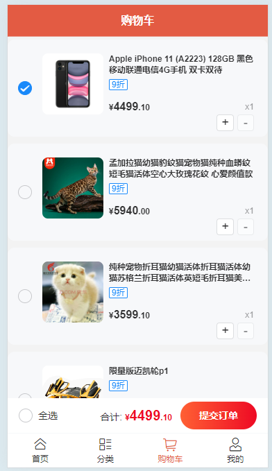
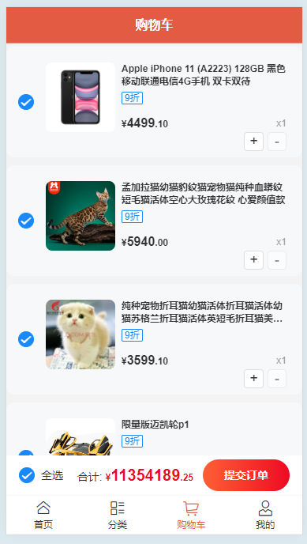

# miemiegou-mobile

This template should help get you started developing with Vue 3 in Vite.

此模板将帮助您开始在Vite中使用Vue 3进行开发。


**一个移动端电商项目--咩咩购**

## Recommended IDE Setup

[VSCode](https://code.visualstudio.com/) + [Vue - Official](https://marketplace.visualstudio.com/items?itemName=Vue.volar) (and disable Vetur).

## Type Support for `.vue` Imports in TS

TypeScript cannot handle type information for `.vue` imports by default, so we replace the `tsc` CLI with `vue-tsc` for type checking. In editors, we need [Volar](https://marketplace.visualstudio.com/items?itemName=Vue.volar) to make the TypeScript language service aware of `.vue` types.

默认情况下，TypeScript无法处理`.vue`导入的类型信息，因此我们将`tsc` CLI替换为`vue-tsc`进行类型检查。在编辑器中，我们需要[Volar]（https：marketplace.visualstudio.com/items? itemName=Vue.volar），以使TypeScript语言服务知道`.vue`类型。


## Project Setup

```sh
npm install
```

### Compile and Hot-Reload for Development

```sh
npm run dev
```

### Type-Check, Compile and Minify for Production

```sh
npm run build
```

## Project Show

一些功能展示

登录：



注册：







首页（轮播图 + 十宫格 + 商品列表[2列]）：


商品列表[1列]：


商品详情：



购物车：




